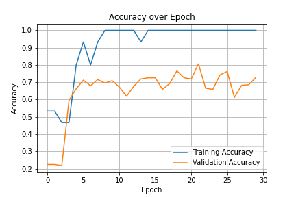
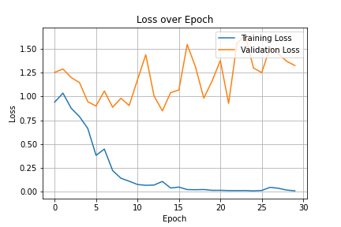
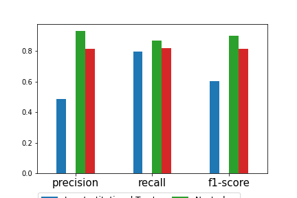
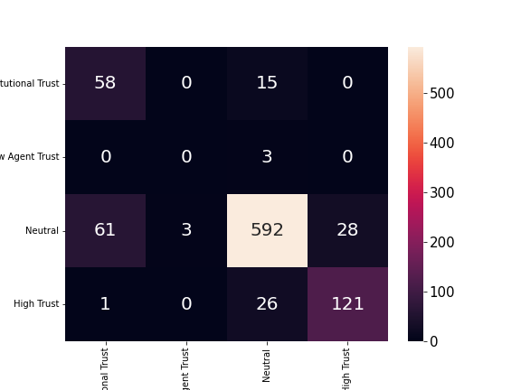

# Dataset Introduction
    Introducing the COVID-19 Vaccine Trust Annotations dataset - a valuable resource for Natural Language Processing (NLP) researchers and practitioners alike. With a total of 3,022 user side inputs taken from VIRADialogs, this dataset has been annotated for trust, making it a useful tool for understanding the level of trust individuals have in the COVID-19 vaccine. The VIRADialogs, developed by Johns Hopkins University, has been utilized as-is for the purpose of this dataset, and credit for VIRADialogs goes solely to them. The dataset is split into three files - train.csv, dev.csv, and test.csv, each containing user inputs and corresponding trust labels, which are categorized as Low Institutional Trust, Low Agent Trust, Neutral, and High Trust, respectively. This dataset is licensed under the Community Data License Agreement - Sharing - Version 1.0.
# Sentence Porecess
    The data preprocessing stage for the COVID-19 Vaccine Trust Annotations dataset involves several steps to prepare the raw text data for training the NLP model.

    Firstly, the raw dataset is split into three subsets, namely the training, validation, and testing sets, to evaluate the model's performance on unseen data.

    The next step in the preprocessing stage is to tokenize the text data using the NLTK library. The cut_word() function is used to tokenize each sentence into individual words or tokens, converting them to lowercase and removing any punctuations.

    After tokenization, the next step is to encode the text data using the pre-trained word embedding model - GGloVe. The sentence_to_vector() function is used to convert each token into a numerical vector representation using the GGloVe model with a dimension of 300. This is important to improve the accuracy of the model by enabling it to understand the relationships between words.

    The data dataframe is then created, which contains the labels and tokenized text data, and is used to create the word list. The texts column is truncated to a maximum length of 100, and the resulting dataframe is then shuffled to reduce any bias in the data.

    Overall, the data preprocessing stage involves transforming the raw text data into a format that can be effectively utilized by the NLP model, ultimately improving the model's performance.
# Build Model
    The model architecture used for the COVID-19 Vaccine Trust Annotations dataset is an Attention-Based Bidirectional Long Short-Term Memory Network (BiLSTM) model, as described in the paper "Attention-Based Bidirectional Long Short-Term Memory Networks for Relation Classification".

    The model consists of an embedding layer, an LSTM layer, a fully connected layer, and an output layer. The embedding layer maps the input tokens to their corresponding vectors using a pre-trained word embedding model (GGloVe). The LSTM layer processes the input sequences in both forward and backward directions and generates a hidden state for each time step.

    The attention mechanism is then applied to the hidden states to assign different weights to different time steps, which helps the model to focus on important information. This is done using a parameter w, which is learned during the training process. The attention output is then fed to a fully connected layer with ReLU activation, followed by an output layer that predicts the label.

    The hyperparameters used for this model are as follows:

    Number of classes: 4 (Low Institutional Trust, Low Agent Trust, Neutral, High Trust)
    Learning rate: 0.001
    Number of epochs: 30
    Embedding dimension: 300
    LSTM hidden size: 128
    Number of LSTM layers: 3
    Hidden size of the fully connected layer: 64
    The model is trained using the Adam optimizer and the cross-entropy loss function. Overall, the Attention-Based BiLSTM model is well-suited for NLP tasks that involve processing sequences of text data and has shown to be effective in many text classification tasks.
# Model Train
    The training process for the COVID-19 Vaccine Trust Annotations dataset involves training the Attention-Based BiLSTM model for a specified number of epochs (30 in this case).

    The training process involves iterating through the training set using a batch size of 128 and minimizing the cross-entropy loss function using the Adam optimizer. The model's training and validation accuracy and loss are recorded and updated after each epoch.

    After training for each epoch, the model is evaluated on the validation set. The model's evaluation accuracy and loss are recorded and used to monitor the model's performance on unseen data.

    The training process continues for the specified number of epochs, with the model continually learning and improving its accuracy and loss.

    Overall, the training process involves finding the optimal set of parameters for the Attention-Based BiLSTM model to improve its accuracy and loss on the task of classifying the trust levels of users' inputs in the COVID-19 vaccine context.
    ***10 Epoch Record***
        Train Loss	Train Acc	Eval Loss	Eval Acc
    0	0.940324	0.533333	1.254119	0.224074
    1	1.035448	0.533333	1.290286	0.224074
    2	0.875876	0.466667	1.199792	0.217407
    3	0.787545	0.466667	1.146730	0.595421
    4	0.663024	0.800000	0.944795	0.662256
    5	0.379091	0.933333	0.899523	0.712458
    6	0.445379	0.800000	1.058634	0.679091
    7	0.219285	0.933333	0.886647	0.715892
    8	0.137798	1.000000	0.981541	0.695859
    9	0.106466	1.000000	0.905241	0.709226

# Evaluate
    As it is a text classification prediction task, this article uses a classification analysis model to evaluate indicators.We used the following indicators to evaluate the predictive performance of machine learning models: Accuracy rate (ACC), Sensitivity/Positive predictive value (PPV), Negative predictive value (NPV), Recall rate (Recall), F1 score. The calculation method is as follows:

        ACC=(TP+TN)/(TP+TN+FP+FN)
        Recall=TP/(TP+FN)
        F_ (1-score)=(2*PPV*Recall)/(PPV+Recall)

    classification_report: 

        Low Institutional Trust	Low Agent Trust	Neutral	High Trust	accuracy	macro avg	weighted avg
        precision	0.483333	0.0	0.930818	0.812081	0.849119	0.556558	0.872412
        recall	    0.794521	0.0	0.865497	0.817568	0.849119	0.619396	0.849119
        f1-score	0.601036	0.0	0.896970	0.814815	0.849119	0.578205	0.856823
        support	    73.000000	3.0	684.000000	148.000000	0.849119	908.000000	908.000000
    
Comapre: 
    
Confusion Matrix: 
  